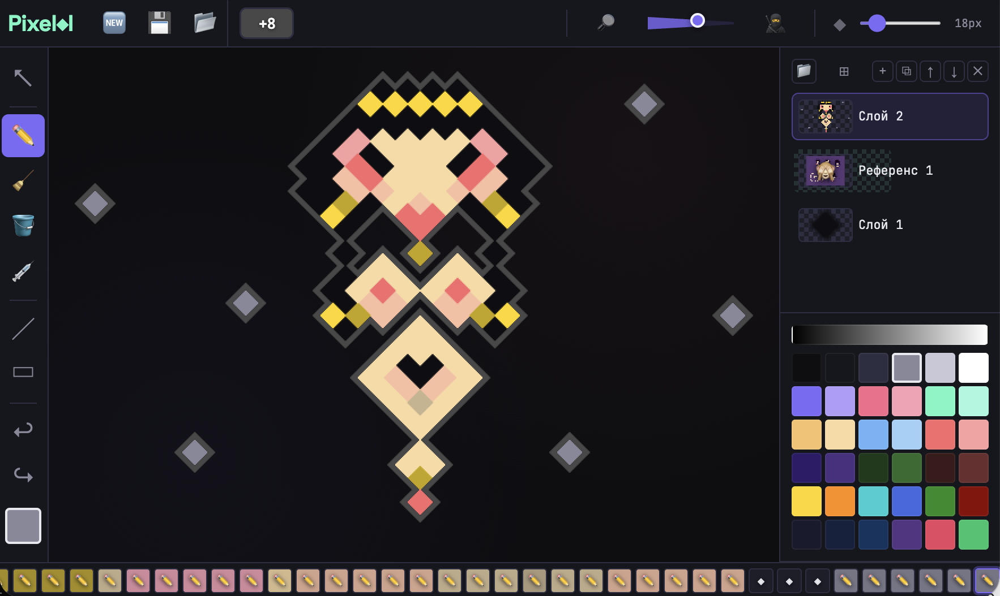

# Pixelol 🔷 [Beta]

> Every pixel art editor on the planet uses the same square grid.
> Pixelol doesn't. The pixel here is a **diamond** — rotated 45°, built in from scratch, not as a filter or a trick.

**[▶ Open in browser — draw right now](https://lexbayart.github.io/pixelol/)**
No install. No account. Works offline.

---

## 🔷 What makes this different

In any other editor, if you want a diagonal pixel look, you rotate the canvas 45°.
That creates two problems: drawing becomes awkward, and when you export — the image is tilted.

In Pixelol, **the diamond is the native pixel**. The coordinate system is normal.
You draw left, right, up, down — exactly like usual.
But the result looks like nothing else in pixel art.

The contour of any character or object drawn in Pixelol is **immediately recognizable**
as something different. Not because of a filter. Because the shape of every single pixel is different.
There is currently no other editor built specifically around this concept.

---

## ✨ Features

🔷 **Diamond pixel grid** — diagonal diamond-shaped pixels as the native format, not a rotation hack

🗂️ **Full layer system** — pixel layers, reference image layers, folder groups, drag-and-drop reordering, per-layer opacity, lock, clipping

🖊️ **Stroke engine** — add outlines to any layer: color, width, style (solid / dashed / dotted), corner type, inside / outside / center position

🎭 **Palette extraction** — drop any photo into the editor and it pulls out the color palette automatically

⏪ **Visual history** — a visual timeline of every action, click any point to jump back

✏️ **Sketch mode** — Alt + pen draws a non-destructive overlay without touching actual pixels

📐 **Reference layers** — import images as drawing references with crop, rotate, resize, opacity

💾 **Export** — PNG, SVG, or native `.lol` project format

🎨 **Drawing tools** — pen, eraser, fill, eyedropper, line, rectangle, select

🔊 **Sound feedback** — subtle audio on interactions

---

## 🖼️ Example

---

## 🚀 Open it

**[▶ lexbayart.github.io/pixelol](https://lexbayart.github.io/pixelol/)**

Or download `index.html` and open locally — fully standalone, works without internet.

---

## 🛠️ Tech

Vanilla JavaScript · HTML5 Canvas · CSS3
Single HTML file · Zero dependencies · Zero build step

---

## 🧪 Dev notes

`docs/` contains the AI audit prompts used during development —
structured bug-detection checklists covering every subsystem.

---

## 💬 Feedback

Found a bug? Have an idea or suggestion? Write to me on Telegram: [@lexbay](https://t.me/lexbay)

---

## 📄 License

MIT
